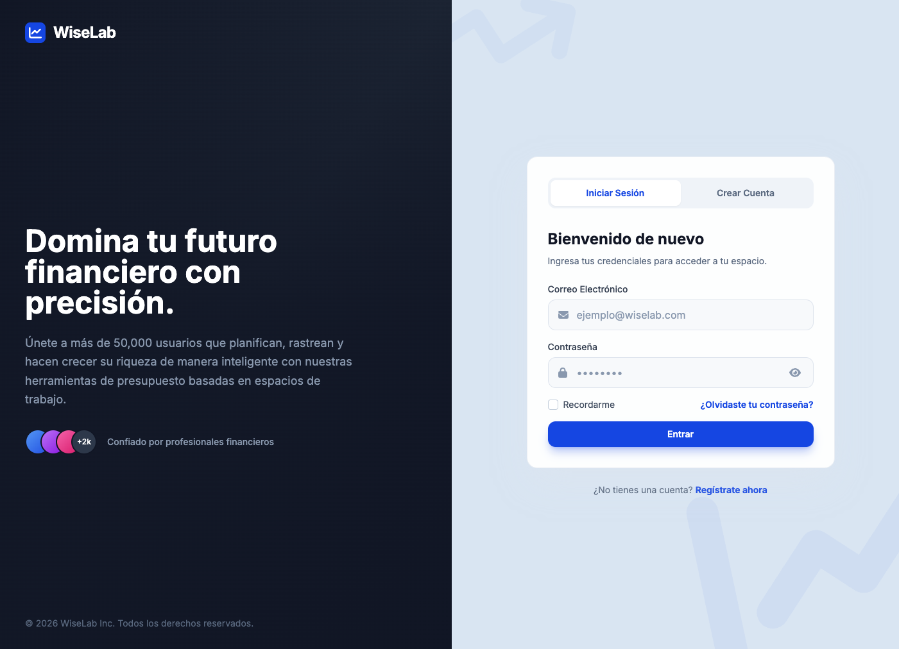
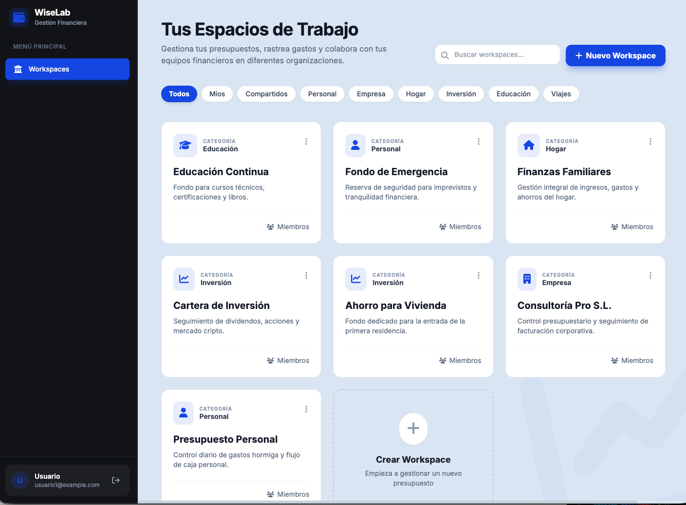

# WiseLab - Sistema de Gestión Financiera Colaborativa





WiseLab es una aplicación web completa para la gestión financiera colaborativa. Permite a los usuarios crear espacios de trabajo compartidos, administrar presupuestos por categoría, y realizar seguimiento de movimientos financieros de manera eficiente y segura.

## Tabla de Contenidos

- [Arquitectura del Proyecto](#arquitectura-del-proyecto)
- [Stack Tecnológico](#stack-tecnológico)
- [Estructura del Proyecto](#estructura-del-proyecto)
- [Módulos del Sistema](#módulos-del-sistema)
- [Flujo de Autenticación](#flujo-de-autenticación)
- [Modelo de Datos](#modelo-de-datos)
- [Endpoints de la API](#endpoints-de-la-api)
- [Ejecución del Proyecto](#ejecución-del-proyecto)
- [Pruebas](#pruebas)
- [Datos de Prueba (Seeder)](#datos-de-prueba-seeder)

---

## Arquitectura del Proyecto

WiseLab está construido utilizando **Arquitectura Limpia (Clean Architecture)** con principios de **Domain-Driven Design (DDD)**. Esta arquitectura permite una separación clara de responsabilidades y facilita el mantenimiento y la escalabilidad del código.

### Capas de la Arquitectura

```
┌─────────────────────────────────────────────────────────────┐
│                    PRESENTATION LAYER                       │
│  (API Routes - FastAPI)                                     │
├─────────────────────────────────────────────────────────────┤
│                   APPLICATION LAYER                         │
│  (Use Cases - Lógica de negocio)                           │
├─────────────────────────────────────────────────────────────┤
│                      DOMAIN LAYER                           │
│  (Entities, Value Objects, Domain Errors, Repositories)      │
├─────────────────────────────────────────────────────────────┤
│                   INFRASTRUCTURE LAYER                      │
│  (Database, Auth Services, Repository Implementations)     │
└─────────────────────────────────────────────────────────────┘
```

### Descripción de las Capas

1. **Capa de Presentación (API Routes)**
   - Ubicación: [`backend/src/api/routes/`](../backend/src/api/routes/)
   - Maneja las solicitudes HTTP entrantes
   - Valida datos entrantes con Pydantic
   - Llama a los casos de uso correspondientes
   - Devuelve respuestas HTTP

2. **Capa de Aplicación (Use Cases)**
   - Ubicación: [`backend/src/application/use_cases/`](../backend/src/application/use_cases/)
   - Contiene la lógica de negocio orquestada
   - Coordina múltiples entidades y repositorios
   - Implementa el patrón de diseño **Interactor**

3. **Capa de Dominio (Domain)**
   - Ubicación: [`backend/src/domain/`](../backend/src/domain/)
   - **Entities**: [`User`](backend/src/domain/auth/models/user.py), [`Workspace`](backend/src/domain/workspace/models/workspace.py), [`Budget`](backend/src/domain/budget/models/budget.py), [`Category`](backend/src/domain/budget/models/category.py), [`WorkspaceMember`](backend/src/domain/workspace/models/member.py)
   - **Value Objects**: [`Email`](backend/src/domain/auth/value_objects/email.py), [`WorkspaceRole`](backend/src/domain/workspace/value_objects/role.py)
   - **Errors**: [`ValidationError`](backend/src/domain/errors.py), [`UnauthorizedError`](backend/src/domain/errors.py), [`NotFoundError`](backend/src/domain/errors.py), etc.
   - Define interfaces de repositorios

4. **Capa de Infraestructura (Infrastructure)**
   - Ubicación: [`backend/src/infrastructure/`](../backend/src/infrastructure/)
   - Implementación de repositorios con SQLAlchemy
   - Servicios de autenticación (JWT, Hasher)
   - Modelos ORM para la base de datos

---

## Stack Tecnológico

### Backend

| Tecnología | Propósito |
|-------------|-----------|
| **FastAPI** | Framework web asíncrono de alto rendimiento |
| **SQLAlchemy 2.0** | ORM con soporte para async/await |
| **PostgreSQL** | Base de datos relacional |
| **asyncpg** | Driver asíncrono para PostgreSQL |
| **Pydantic** | Validación de datos y serialización |
| **JWT (python-jose)** | Autenticación basada en tokens |
| **Passlib + Argon2** | Hashing de contraseñas seguro |
| **Alembic** | Migraciones de base de datos |
| **Pytest** | Framework de pruebas |

### Frontend

| Tecnología | Propósito |
|-------------|-----------|
| **React 18** | Biblioteca de interfaz de usuario |
| **TypeScript** | Tipado estático |
| **Vite** | Build tool y servidor de desarrollo |
| **Redux Toolkit** | Gestión de estado global |
| **React Router** | Navegación entre páginas |
| **Axios** | Cliente HTTP |
| **TailwindCSS** | Framework de estilos |
| **Framer Motion** | Animaciones |

### Infraestructura

| Tecnología | Propósito |
|-------------|-----------|
| **Docker** | Contenedorización de servicios |
| **Docker Compose** | Orquestación de contenedores |

---

## Estructura del Proyecto

```
wiselab/
├── backend/                      # Aplicación FastAPI
│   ├── src/
│   │   ├── api/                  # Capa de presentación
│   │   │   ├── main.py           # Punto de entrada FastAPI
│   │   │   ├── dependencies/     # Dependencias inyectables
│   │   │   └── routes/           # Endpoints (auth, workspace, budget)
│   │   ├── application/          # Capa de aplicación
│   │   │   └── use_cases/        # Casos de uso por módulo
│   │   ├── domain/               # Capa de dominio
│   │   │   ├── base.py           # Clase base Entity
│   │   │   ├── errors.py         # Errores de dominio
│   │   │   ├── auth/             # Módulo de autenticación
│   │   │   ├── workspace/        # Módulo de espacios de trabajo
│   │   │   └── budget/           # Módulo de presupuestos
│   │   └── infrastructure/       # Capa de infraestructura
│   │       ├── database.py       # Configuración de base de datos
│   │       ├── auth/             # Implementación auth (JWT, hashing)
│   │       ├── budget/           # Implementación repositorios budget
│   │       └── workspace/        # Implementación repositorios workspace
│   ├── migrations/               # Migraciones Alembic
│   ├── tests/                    # Suite de pruebas
│   │   ├── unit/                 # Pruebas unitarias
│   │   ├── integration/          # Pruebas de integración
│   │   └── e2e/                  # Pruebas end-to-end
│   ├── seed_data.py              # Script para poblar datos de prueba
│   ├── requirements.txt          # Dependencias Python
│   └── Dockerfile                # Imagen Docker del backend
│
├── frontend/                     # Aplicación React
│   ├── src/
│   │   ├── components/           # Componentes reutilizables
│   │   ├── pages/                # Páginas de la aplicación
│   │   ├── services/             # Llamadas a la API
│   │   ├── store/                # Configuración Redux
│   │   └── ...
│   ├── package.json              # Dependencias Node.js
│   └── Dockerfile               # Imagen Docker del frontend
│
├── docker-compose.yml            # Orquestación de servicios
├── alembic.ini                   # Configuración Alembic
└── README.md                     # Este archivo
```

---

## Módulos del Sistema

WiseLab está compuesto por tres módulos principales que trabajan en conjunto:

### 1. Módulo de Autenticación (Auth)

**Propósito**: Manejo de usuarios, registro, login y seguridad.

**Características**:
- Registro de usuarios con validación de email
- Login con verificación de contraseña
- Tokens JWT de acceso (30 minutos) y refresh (7 días)
- Renovación de tokens expirados
- Validación de emails mediante value objects

**Archivos clave**:
- [`backend/src/domain/auth/models/user.py`](backend/src/domain/auth/models/user.py) - Entidad User
- [`backend/src/domain/auth/value_objects/email.py`](backend/src/domain/auth/value_objects/email.py) - Value Object Email
- [`backend/src/infrastructure/auth/services/jwt.py`](backend/src/infrastructure/auth/services/jwt.py) - Servicio JWT
- [`backend/src/infrastructure/auth/services/hasher.py`](backend/src/infrastructure/auth/services/hasher.py) - Servicio de hashing

### 2. Módulo de Espacios de Trabajo (Workspace)

**Propósito**: Gestión de espacios de trabajo colaborativos y membresías.

**Características**:
- Crear, editar y eliminar espacios de trabajo
- Sistema de roles para miembros: `OWNER`, `ADMIN`, `EDITOR`, `VIEWER`
- Invitación de usuarios a espacios de trabajo
- Actualización y remoción de miembros
- Validación de permisos por rol

**Roles y Permisos**:
| Rol | Crear Budget | Editar Budget | Eliminar Budget | Gestionar Miembros | Editar Workspace | Eliminar Workspace |
|-----|-------------|---------------|-----------------|-------------------|------------------|-------------------|
| OWNER | ✅ | ✅ | ✅ | ✅ | ✅ | ✅ |
| ADMIN | ✅ | ✅ | ✅ | ✅ | ✅ | ❌ |
| EDITOR | ✅ | ✅ | ❌ | ❌ | ❌ | ❌ |
| VIEWER | ❌ | ❌ | ❌ | ❌ | ❌ | ❌ |

**Archivos clave**:
- [`backend/src/domain/workspace/models/workspace.py`](backend/src/domain/workspace/models/workspace.py) - Entidad Workspace
- [`backend/src/domain/workspace/models/member.py`](backend/src/domain/workspace/models/member.py) - Entidad WorkspaceMember
- [`backend/src/domain/workspace/value_objects/role.py`](backend/src/domain/workspace/value_objects/role.py) - Roles disponibles

### 3. Módulo de Presupuestos (Budget)

**Propósito**: Administración de presupuestos, categorías y seguimiento de gastos.

**Características**:
- Crear presupuestos por categoría y período (mes/año)
- Actualizar límites de presupuesto
- Listar presupuestos con filtros (workspace, categoría, mes, año)
- Eliminación suave (soft delete)
- Sistema de categorías (por defecto y personalizadas por workspace)
- Cálculo de progreso y gastos realizados

**Entidades**:
- **Budget**: Define un límite de gasto para una categoría en un mes/año específico
- **Category**: Categorías de gasto (Vivienda, Transporte, Alimentación, etc.)

**Categorías por defecto** (creadas en español):
1. Vivienda - Alquiler, hipoteca, servicios del hogar
2. Transporte - Combustible, transporte público, mantenimiento
3. Alimentación - Supermercado, restaurantes, snacks
4. Servicios - Electricidad, agua, internet, telefonía
5. Salud y Bienestar - Gimnasio, seguros, gastos médicos
6. Compras - Ropa, electrónica, artículos para el hogar
7. Entretenimiento - Cine, juegos, eventos sociales
8. Educación - Cursos, libros, colegiaturas
9. Viajes - Vuelos, hoteles, vacaciones
10. Inversiones - Acciones, criptomonedas, ahorros
11. Otros - Gastos varios no categorizados

**Archivos clave**:
- [`backend/src/domain/budget/models/budget.py`](backend/src/domain/budget/models/budget.py) - Entidad Budget
- [`backend/src/domain/budget/models/category.py`](backend/src/domain/budget/models/category.py) - Entidad Category
- [`backend/src/application/use_cases/budget/`](backend/src/application/use_cases/budget/) - Casos de uso de presupuestos

---

## Flujo de Autenticación

WiseLab utiliza un sistema de autenticación basado en **JSON Web Tokens (JWT)** con soporte para renovación de tokens.

### Flujo de Login

```
┌──────────┐     ┌──────────┐     ┌──────────┐     ┌──────────┐
│  Client  │────▶│  FastAPI │────▶│ Use Case │────▶│ Repository│
│          │     │  Route   │     │  Login   │     │  (User)   │
└──────────┘     └──────────┘     └──────────┘     └──────────┘
                                              │
                                              ▼
                                        ┌──────────┐
                                        │  Verify  │
                                        │ Password │
                                        └──────────┘
                                              │
                                              ▼
                                        ┌──────────┐
                                        │  Generate│
                                        │   JWT    │
                                        └──────────┘
                                              │
                                              ▼
                                        ┌──────────┐
                                        │ Return   │
                                        │ Response │
                                        └──────────┘
```

### Tipos de Tokens

| Token | Expiración | Uso |
|-------|------------|-----|
| **access_token** | 30 minutos | Acceder a endpoints protegidos |
| **refresh_token** | 7 días | Renovar access_token sin hacer login |

### Renovación de Token

Cuando el access_token expira, el cliente debe enviar el refresh_token al endpoint `/api/auth/refresh` para obtener un nuevo par de tokens.

---

### Tablas en PostgreSQL

1. **users** - Usuarios registrados
2. **workspaces** - Espacios de trabajo
3. **workspace_members** - Relación muchos-a-muchos entre usuarios y workspaces con roles
4. **categories** - Categorías de presupuesto
5. **budgets** - Presupuestos por categoría y período

---

## Endpoints de la API

### Autenticación

| Método | Endpoint | Descripción |
|--------|----------|-------------|
| POST | `/api/auth/register` | Registrar nuevo usuario |
| POST | `/api/auth/login` | Iniciar sesión |
| POST | `/api/auth/refresh` | Renovar access token |

### Espacios de Trabajo

| Método | Endpoint | Descripción |
|--------|----------|-------------|
| POST | `/api/workspaces` | Crear workspace |
| GET | `/api/workspaces` | Listar workspaces del usuario |
| GET | `/api/workspaces/{id}` | Obtener workspace por ID |
| PUT | `/api/workspaces/{id}` | Actualizar workspace |
| DELETE | `/api/workspaces/{id}` | Eliminar workspace |
| POST | `/api/workspaces/{id}/members` | Invitar miembro |
| GET | `/api/workspaces/{id}/members` | Listar miembros |
| PUT | `/api/workspaces/{id}/members/{user_id}` | Actualizar rol de miembro |
| DELETE | `/api/workspaces/{id}/members/{user_id}` | Remover miembro |

### Presupuestos

| Método | Endpoint | Descripción |
|--------|----------|-------------|
| POST | `/api/budgets` | Crear presupuesto |
| GET | `/api/budgets` | Listar presupuestos (con filtros) |
| GET | `/api/budgets/{id}` | Obtener presupuesto |
| PUT | `/api/budgets/{id}` | Actualizar presupuesto |
| DELETE | `/api/budgets/{id}` | Eliminar presupuesto |
| GET | `/api/budgets/categories` | Listar categorías |

### Salud

| Método | Endpoint | Descripción |
|--------|----------|-------------|
| GET | `/` | Verificar que la API está funcionando |
| GET | `/health` | Estado de salud de la API |

---

## Ejecución del Proyecto

### Requisitos Previos

- Docker y Docker Compose instalados
- Puerto 5432 (PostgreSQL), 8000 (Backend), 3000 (Frontend) disponibles

### Comandos de Ejecución

#### 1. Iniciar servicios normales

```bash
docker-compose up --build
```

Esto levantará:
- Base de datos PostgreSQL en el puerto 5432
- Backend FastAPI en http://localhost:8000
- Frontend React en http://localhost:3000

#### 2. Iniciar con datos de prueba

```bash
SEED_DB=true docker-compose up --build
```

Crea datos de prueba si no existen.

#### 3. Resetear y repoblar base de datos

```bash
RESET_DB=true docker-compose up --build
```

Elimina todos los datos existentes y los reemplaza con datos de prueba.

### Acceso a la Aplicación

| Servicio | URL |
|----------|-----|
| **Frontend** | http://localhost:3000 |
| **API (Backend)** | http://localhost:8000/api |
| **Swagger UI** | http://localhost:8000/docs |
| **ReDoc** | http://localhost:8000/redoc |

### Variables de Entorno

El archivo `docker-compose.yml` utiliza las siguientes variables de entorno (con valores por defecto):

| Variable | Default | Descripción |
|----------|---------|-------------|
| POSTGRES_USER | postgres | Usuario de PostgreSQL |
| POSTGRES_PASSWORD | postgres | Contraseña de PostgreSQL |
| POSTGRES_DB | wiselab | Nombre de la base de datos |
| SECRET_KEY | 5SJ3@Nv715c6 | Clave secreta para JWT |
| ALGORITHM | HS256 | Algoritmo de firma JWT |
| ACCESS_TOKEN_EXPIRE_MINUTES | 30 | Expiración del token de acceso |

---

## Pruebas

WiseLab cuenta con una suite completa de pruebas organizadas en tres niveles:

### 1. Pruebas Unitarias

Prueban componentes individuales en aislamiento.

```bash
# Ejecutar todas las pruebas unitarias
docker-compose exec backend pytest tests/unit/

# Ejecutar con cobertura
docker-compose exec backend pytest tests/unit/ --cov=src --cov-report=term-missing
```

### 2. Pruebas de Integración

Prueban la interacción entre componentes.

```bash
docker-compose exec backend pytest tests/integration/
```

### 3. Pruebas End-to-End

Prueban la aplicación completa simulando escenarios reales.

```bash
docker-compose exec backend pytest tests/e2e/
```

### Ejecutar Todas las Pruebas

```bash
# Con Docker
docker-compose exec backend pytest

# Con reporte de cobertura
docker-compose exec backend pytest --cov=src --cov-report=term-missing
```

---

## Datos de Prueba (Seeder)

Al ejecutar el proyecto con `SEED_DB=true` o `RESET_DB=true`, se crean automáticamente los siguientes datos:

### Usuarios de Prueba

| Email | Contraseña |
|-------|------------|
| usuario1@example.com | password123 |
| usuario2@example.com | password123 |
| usuario3@example.com | password123 |
| usuario4@example.com | password123 |
| usuario5@example.com | password123 |

### Espacios de Trabajo (10)

1. Finanzas Familiares
2. Consultoría Pro S.L.
3. Ahorro para Vivienda
4. Gastos del Viaje Japón
5. Cartera de Inversión
6. Educación Continua
7. Presupuesto Personal
8. Startup Ecommerce
9. Mantenimiento del Hogar
10. Fondo de Emergencia

### Otros Datos

- 20 membresías adicionales entre usuarios y workspaces
- 10 presupuestos iniciales para el mes actual
- 11 categorías por defecto en español

---

## Estado del Proyecto

El proyecto se encuentra en **desarrollo activo**:

- ✅ **Backend API**: Completado con todos los módulos funcionales
- ✅ **Sistema de Autenticación**: JWT, registro, login, refresh tokens
- ✅ **Gestión de Workspaces**: CRUD completo con sistema de miembros y roles
- ✅ **Gestión de Presupuestos**: CRUD completo con categorías y seguimiento de progreso
- ✅ **Base de Datos**: PostgreSQL con migraciones Alembic
- ✅ **Pruebas**: Suite completa (unitarias, integración, e2e)
- 🔄 **Frontend**: Módulos de autenticación y workspaces completados
- 🔄 **Movimientos Financieros**: En proceso de implementación

---

## Contribuir

1. Fork el repositorio
2. Crea una rama (`git checkout -b feature/nueva-caracteristica`)
3. Commitea tus cambios (`git commit -am 'Agrega nueva característica'`)
4. Push a la rama (`git push origin feature/nueva-caracteristica`)
5. Crea un nuevo Pull Request

---

## Licencia

Este proyecto está bajo la Licencia MIT.
